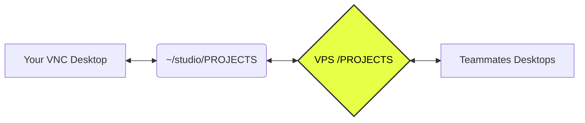

-----

# NRR Cloud Studio Manual

> **Internal Team Doc · v5**

How to set up, use, and stay in sync with the shared cloud workstation.

-----

## 📑 Contents

1.  [System Overview](https://www.google.com/search?q=%2301--system-overview)
2.  [First-Time Setup](https://www.google.com/search?q=%2302--first-time-setup)
3.  [Folder Structure](https://www.google.com/search?q=%2303--folder-structure)
4.  [Command Reference](https://www.google.com/search?q=%2304--command-reference)
5.  [Daily Workflows](https://www.google.com/search?q=%2305--daily-workflows)
6.  [Team Rules](https://www.google.com/search?q=%2306--team-rules)
7.  [Troubleshooting](https://www.google.com/search?q=%2307--troubleshooting)
8.  [FAQ](https://www.google.com/search?q=%2308--faq)

-----

## 01 — System Overview

NRR Studio runs on a central VPS that holds all shared project files, Blender builds, and asset libraries. Each team member connects to it through a cloud workstation (VNC desktop) that is bootstrapped automatically. Files sync between your local workspace and the VPS using **rclone** over a private SSH connection.

### Data Flow



> [\!NOTE]
> **Key Concept:** Your `~/studio/` folder is your local workspace. The VPS is the shared source of truth. Syncing is *not automatic on pull* — you control when you fetch new work.

### Auto-sync

Your `PROJECTS` folder pushes to the VPS automatically every **5 minutes** in the background. You don't need to do anything for your saves to reach the server — but you do need to manually pull to receive other people's changes.

-----

## 02 — First-Time Setup

You only need to run this once per machine or new VNC session. Ask the team lead for your `VPS_SSH_KEY_B64` value before starting.

1.  **Open a terminal** inside the VNC desktop.
2.  **Export your SSH key** (provided by the team lead — keep this private):
    ```bash
    export VPS_SSH_KEY_B64="paste_your_key_here"
    ```
3.  **Run the bootstrap script**:
    ```bash
    curl -fsSL https://raw.githubusercontent.com/YOUR_REPO/bootstrap.sh | bash
    ```
4.  **Wait for it to finish.** It will download all project files, set up Blender, and register all aliases.
5.  **Reload your shell** so aliases are available:
    ```bash
    source ~/.bashrc
    ```
6.  **Launch Blender** from the Desktop shortcut or type `studio-open`.

> [\!WARNING]
> **Important:** Never share your `VPS_SSH_KEY_B64` in chat, email, or commits. Treat it like a password.

-----

## 03 — Folder Structure

Save everything you want synced inside `~/studio/PROJECTS/`. Files saved anywhere else will not reach the VPS.

```text
~/studio/
├── PROJECTS/           # Your working files (synced every 5 min)
│   ├── my_scene/
│   └── client_render/
├── LIBRARY_GLOBAL/     # Shared assets, HDRIs, materials (read-heavy)
├── BLENDER_APPS/       # Blender install (do not edit)
│   └── blender-app/    # Extracted Blender 4.5.7 binary
└── CONFIG_MASTER/      # Shared startup files, preferences, keymaps
```

-----

## 04 — Command Reference

All commands are available in any terminal after running the bootstrap.

| Command | What it does | Direction |
| :--- | :--- | :--- |
| `studio-pull` | Pulls PROJECTS, LIBRARY\_GLOBAL, and CONFIG\_MASTER from VPS. | `← VPS` |
| `studio-pull-projects` | Pulls PROJECTS only — skips library and config. Faster. | `← VPS` |
| `studio-push` | Immediately pushes your entire PROJECTS folder to the VPS. | `→ VPS` |
| `studio-push-folder` | Push a single named project folder: `studio-push-folder my_scene` | `→ VPS` |
| `studio-sync` | Runs a full pull (all folders) followed by a push. | `← VPS` / `→ VPS` |
| `studio-status` | Shows files that differ between local and VPS (Read-only). | `Check` |
| `studio-ls` | Lists all files currently in the VPS PROJECTS folder with sizes. | `Read` |
| `studio-log` | Streams the live sync log (`Ctrl+C` to exit). | `Log` |
| `studio-open` | Launches Blender 4.5.7 in the background. | `App` |

-----

## 05 — Daily Workflows

### Starting a session

1.  Open terminal in VNC.
2.  Pull latest work: `studio-pull`
3.  Launch Blender: `studio-open`
4.  Work normally. Your saves auto-push every 5 minutes.

### Handing off to a teammate

1.  Save your blend file inside `~/studio/PROJECTS/your_folder/`.
2.  Force-push immediately: `studio-push`
3.  Tell your teammate to run `studio-pull-projects`.

### Uploading a packed .blend from local machine

1.  Copy your `.blend` into the correct folder under `~/studio/PROJECTS/` on the VNC desktop.
2.  Push it up immediately: `studio-push-folder your_project_folder`
3.  Confirm it landed: `studio-ls`

> [\!IMPORTANT]
> **Avoid conflicts:** Do not have two people working on the same `.blend` file at the same time. Rclone is a "last-write-wins" system. Coordinate before working on the same file.

-----

## 06 — Team Rules

  * **Always save inside `~/studio/PROJECTS/`**: Files saved elsewhere are local-only and lost when sessions reset.
  * **Use subfolders**: Don't dump files in the root. Use `PROJECTS/renders_john/` or `PROJECTS/client_abc/`.
  * **Communicate**: If you're pushing a large scene (packed textures, etc.), tell the team.
  * **Don't edit LIBRARY\_GLOBAL/CONFIG\_MASTER**: These affect everyone. Consult the team lead first.
  * **Pack your files**: Use **File → External Data → Pack All Into .blend** before handoffs to prevent missing textures.

-----

## 07 — Troubleshooting

### Commands not found

The aliases live in `~/.bashrc`. Fix by running:

```bash
source ~/.bashrc
```

### Connection Refused / Handshake Failed

SSH key may have reset. Re-run bootstrap with the correct `VPS_SSH_KEY_B64`.

### Blender can't find textures

The file was likely not packed. Ask the author to re-pack and push, or use **File → External Data → Find Missing Files** pointed at `~/studio/LIBRARY_GLOBAL/`.

### Check the Log

To see detailed error messages (like network timeouts):

```bash
studio-log
```

-----

## 08 — FAQ

**Do I need to push manually? Won't the cron do it?**
The cron pushes every 5 minutes. Manual push is only for immediate handoffs.

**What happens if I forget to pull before working?**
You may overwrite a teammate's newer version when you push. Always pull at the start of a session.

**Will my work survive a VNC session reset?**
Yes—as long as you saved in `PROJECTS` and it had 5 minutes to sync. After reset, just run `studio-pull-projects`.

**How do I check my Blender version?**

```bash
~/studio/BLENDER_APPS/blender-app/blender --version
```

-----

**NRR Cloud Studio — Keep this private**
